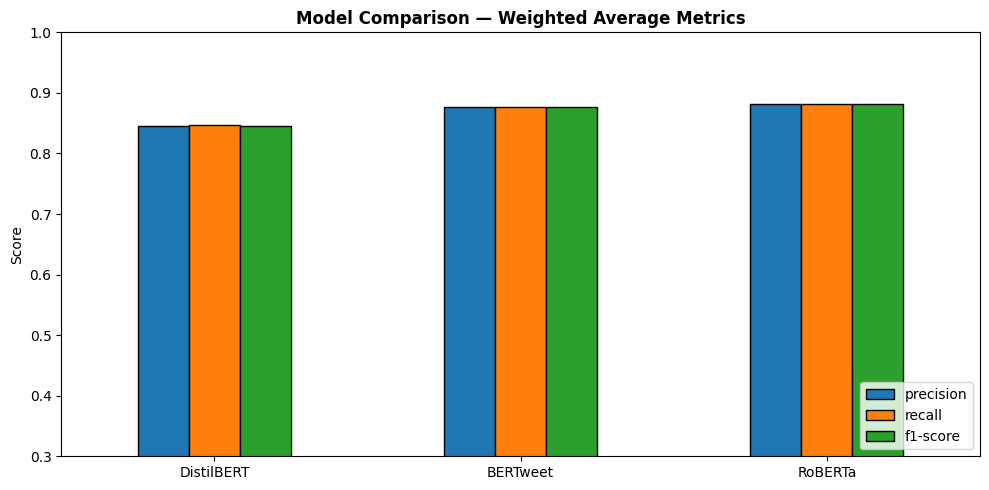
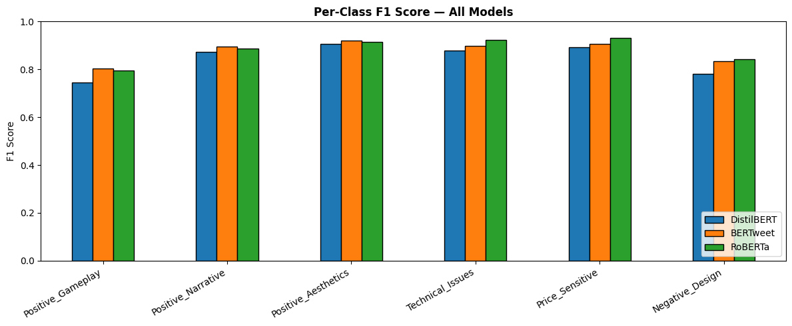
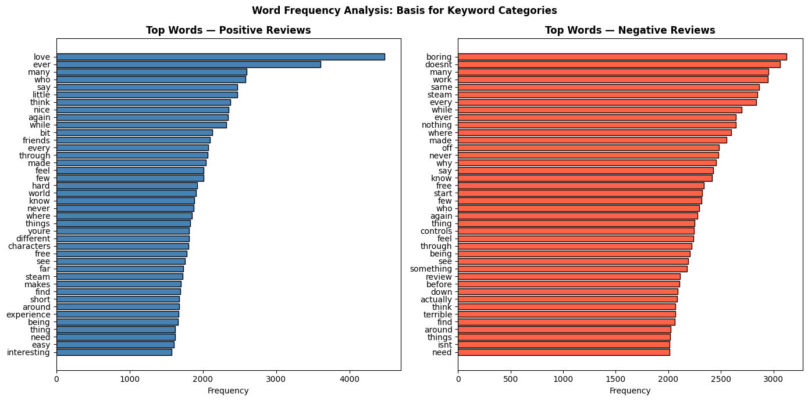
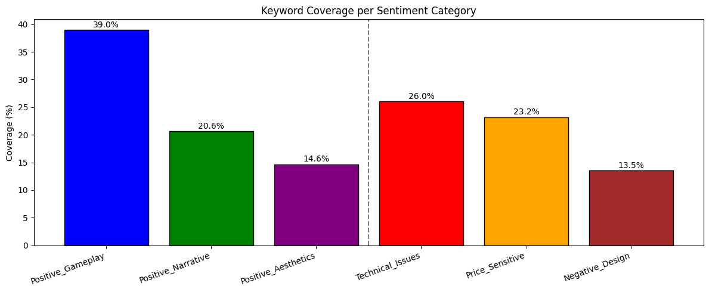
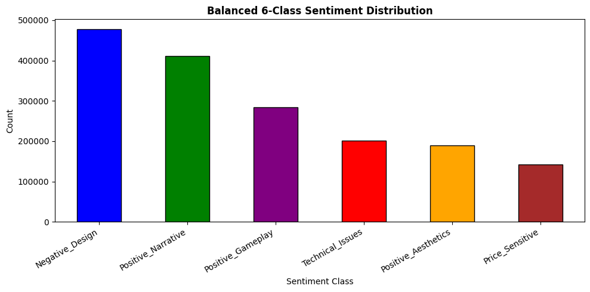
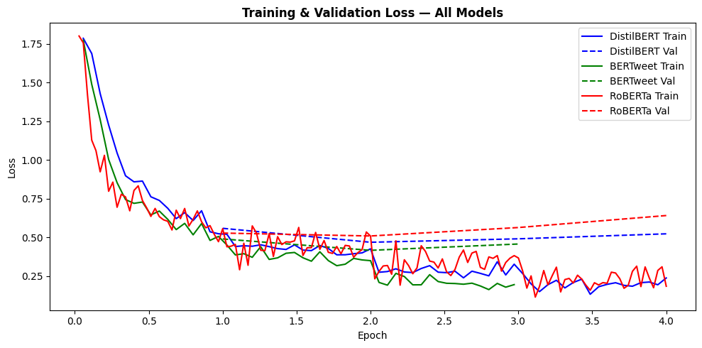
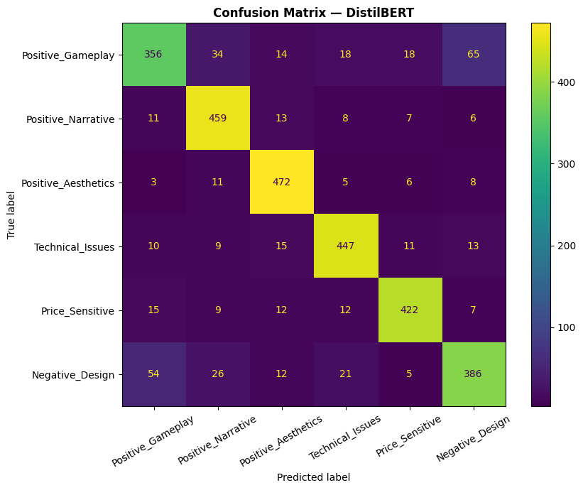
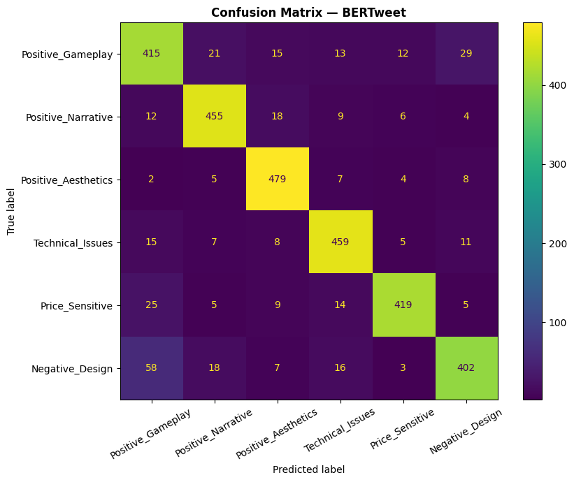
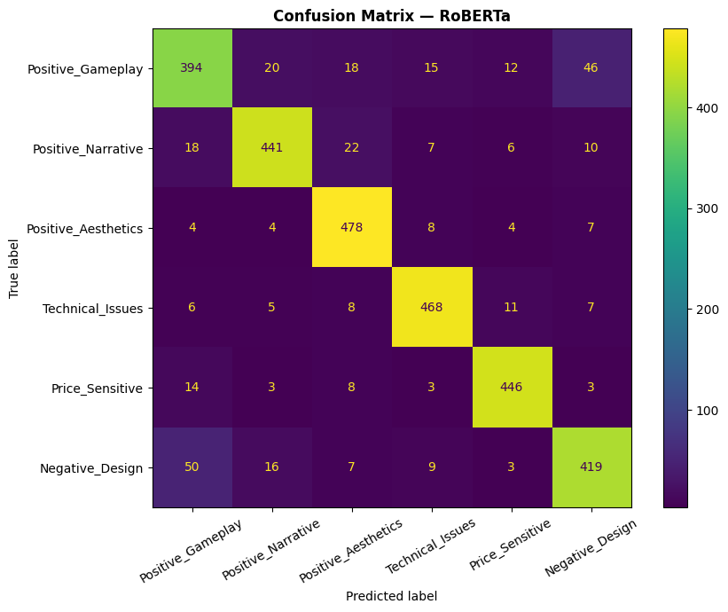

# Granular Sentiment Pipeline: Class-Weighted Transformers for Steam Reviews

Fine-tuning three transformer architectures (DistilBERT, BERTweet, RoBERTa) to classify Steam game reviews into a **custom 6-class sentiment taxonomy**, extending beyond Steam's native binary "recommended / not recommended" label to give game developers actionable, dimension-specific feedback.

> Originally built for CI7525 (Natural Language Processing), Kingston University London.

## Why this project

Steam's binary recommendation system tells a developer *that* 18.5% of players are unhappy, but not *why*. This pipeline breaks sentiment down into six categories so that technical, pricing, and design issues can be triaged separately from praise for gameplay, narrative, or aesthetics:

| Label | Class | Polarity |
|---|---|---|
| 0 | Positive_Gameplay | Positive |
| 1 | Positive_Narrative | Positive |
| 2 | Positive_Aesthetics | Positive |
| 3 | Technical_Issues | Negative |
| 4 | Price_Sensitive | Negative |
| 5 | Negative_Design | Negative |

## Pipeline overview

1. **Data**: [`SirSkandrani/steam_reviews_clean`](https://huggingface.co/datasets/SirSkandrani/steam_reviews_clean) — 4.4M+ Steam reviews with binary recommendation labels.
2. **Cleaning**: null/short-review removal, deduplication, 512-character length cap.
3. **Labelling**: a keyword-scoring scheme (derived from frequency analysis on 50k positive / 50k negative samples) splits each binary class into 3 sub-classes.
4. **Balancing**: dominant classes capped at 150k samples, plus `sklearn`'s `compute_class_weight` fed into a custom `WeightedTrainer` (class-weighted cross-entropy).
5. **Modelling**: three HuggingFace transformers fine-tuned on an identical 20k-sample stratified train/val/test split (70/15/15), 128-token max length, 4 epochs:
   - **DistilBERT** — lightweight efficiency baseline
   - **BERTweet** — pretrained on social-media text, testing the domain-matching hypothesis
   - **RoBERTa** — robustly-optimised general-purpose pretraining
6. **Evaluation**: per-class F1, confusion matrices, weighted precision/recall/F1/accuracy, and loss-curve analysis for overfitting.

## Results

| Model | Weighted F1 | Accuracy |
|---|---|---|
| DistilBERT | 0.8457 | ~84.7% |
| BERTweet | 0.8761 | 87.6% |
| **RoBERTa** | **0.8814** | **88.2%** |

All three comfortably beat the 16.7% random baseline for 6-class classification.

<p align="center">
  
</p>

**Key finding:** the best model isn't uniform across classes. RoBERTa dominates on lexically distinctive negative categories (Technical_Issues, Price_Sensitive), while BERTweet's tweet-pretraining gives it an edge on the noisiest class, short meme-style `Positive_Gameplay` reviews, suggesting an ensemble could outperform any single model. Full analysis and limitations (label noise, sarcasm, training-data volume) are in the [report](docs/CI7525_NLP_Group_25_Assignment_B_Report.docx).

<p align="center">
  
</p>

## Visuals

<table>
<tr>
<td width="50%">

**Class taxonomy derivation** — word frequency analysis on 50k positive / 50k negative reviews motivated the six keyword categories:



</td>
<td width="50%">

**Keyword coverage** — how much of each sampled category was captured by its keyword list:



</td>
</tr>
<tr>
<td width="50%">

**Class balancing** — `Positive_Gameplay` dominated as a catch-all (68%) before capping dominant classes at 150k samples:



</td>
<td width="50%">

**Training dynamics** — all three models peak at epoch 2, with RoBERTa showing the strongest overfitting from epoch 3 onward:



</td>
</tr>
</table>

**Confusion matrices** (DistilBERT · BERTweet · RoBERTa) — the recurring error pattern is `Positive_Gameplay` ⇄ `Negative_Design` confusion, since both act as catch-all defaults for reviews without distinctive keywords:

<p align="center">
  
  
  
</p>

## Repo structure

```
.
├── notebooks/
│   └── steam_review_sentiment_eda.ipynb   # full pipeline: EDA, labelling, training, evaluation
├── docs/
│   └── CI7525_NLP_Group_25_Assignment_B_Report.docx   # full written report
├── images/                                # plots exported from the notebook, used in this README
├── requirements.txt
└── README.md
```

> Note: the notebook was run on Colab, so training checkpoints and the intermediate data subset (`data/`, `checkpoints/`) aren't included in this repo — running the notebook end-to-end regenerates them locally.

## Running it

The notebook was developed for Google Colab (GPU runtime). To run locally:

```bash
pip install -r requirements.txt
jupyter notebook notebooks/steam_review_sentiment_eda.ipynb
```

A CUDA-enabled GPU is strongly recommended for the fine-tuning cells.

## Tech stack

Python · PyTorch · HuggingFace `transformers` & `datasets` · scikit-learn · pandas · matplotlib / seaborn

## Limitations & future work

- The `Positive_Gameplay` catch-all class introduces label noise (reviews without matched keywords default here), which future work could resolve with active learning.
- Training used a 20k-sample subset due to Colab GPU limits; scaling to the full ~840k balanced dataset would likely recover several F1 points.
- Steam's ironic/sarcastic review culture ("this game ruined my life 10/10") is a known source of mislabelling not addressed by keyword scoring.
- A soft-voting ensemble of RoBERTa + BERTweet is a promising next step given their complementary per-class strengths.

## Author

Mohammed Meraj Rahman — [GitHub](https://github.com/Omicron69)
